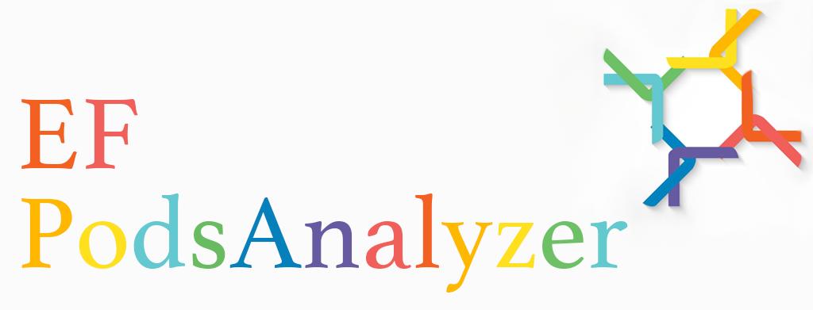
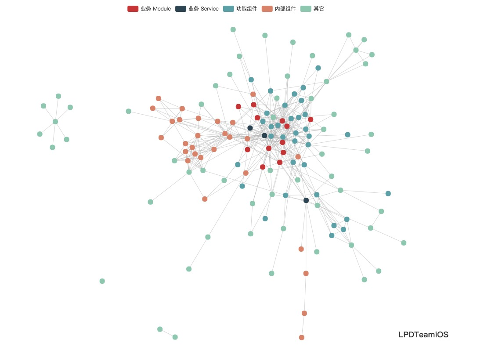
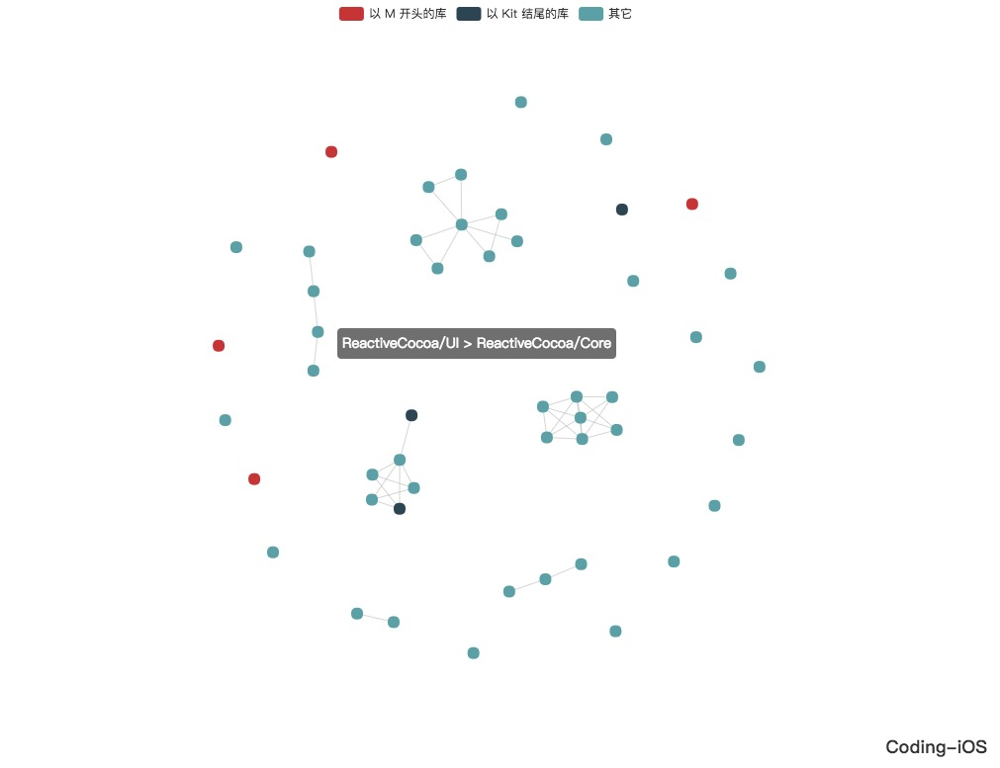

<p align="center">
    <a href="https://www.python.org/">
        
    </a>
    <a href="https://codebeat.co/projects/github-com-eyrefree-efpodsanalyzer-master">
        
    </a>
    <a href="https://raw.githubusercontent.com/EyreFree/EFPodsAnalyzer/master/LICENSE">
        </a>
    </a>
    <a href="https://twitter.com/EyreFree777">
        
    </a>
    <a href="http://weibo.com/eyrefree777">
        
    </a>
    <a href="https://raw.githubusercontent.com/EyreFree/EFQRCode/assets/icon/MadeWith%3C3.png">
        
    </a>
</p>

EFPodsAnalyzer is a Python script that is used to help us sort out the CoaoaPods library dependency relationship. It can generate clear Pods dependency graph with only one command, which will help us in dependency sorting / component cleaning.

> [中文介绍](/README_CN.md)

## Preview

The more the Pods library is, the more complex the library is, the more it is used to get the tool, for example, the modularized item; conversely, if the project dependency is very few and the dependency relation is very simple, there is no need for this tool. The dependency graph of a project of our company is as follows, looks like a shit:



## Requirements

- Python 2.7

## Installation

Download this project, or execute the following commands to Clone this project:

```
git clone git@github.com:EyreFree/EFPodsAnalyzer.git
```

## Usage

1. First, ensure that your project has been operated on `pod install` and successfully generated the Pods directory;
2. The content of this tool has been fully downloaded to the local area;
3. Classify the dependent libraries according to the specific circumstances of the projects to be analyzed, and give the regex of each category separately, then write the rules to the `config.json` file under the EFPodsAnalyzer root directory;
4. Execute the following commands for the generation of the dependency graph:

```
python [EFPodsAnalyzer.py file path] [Target Podfile file path]
```

5. The result page will be automatically opened by browser. If nothing happened, you can check the output of the terminal. If you see the following log, you can manually open the generated file with the path:

```
Dependency graph generated: .../EFPodsAnalyzer/doc/index.html
```

If there is any error, please deal with the corresponding error information, or you can make a PR or an Issue.

## Example

Here we take [Coding's open source iOS client](https://github.com/Coding/Coding-iOS) as an example to show you the complete use of this tool:

1. First, download the content of this tool to the local.
2. Then download the Coding iOS project to local, and perform `pod install` operation;
3. Because the dependency of the Coding client is basically not classified, which is all the third party library. Therefore, for demonstration purposes, I divide it into three categories: the library with the beginning of 'M', the library ending with 'Kit' and the others. The `config.json` is as follows:

```
{
    "config": {
        "categories": ["以 M 开头的库", "以 Kit 结尾的库", "其它"],
        "categoryRegexes": ["^M.*", ".*(Kit)$", ".*"]
    }
}
```

4. The command to generate diagram is as follows:

```
python /Users/eyrefree/Documents/iOS_GitHub/EFPodsAnalyzer/EFPodsAnalyzer.py /Users/eyrefree/Documents/iOS_GitHub/Coding-iOS/Podfile
```

5. The final dependency graph is generated as follows:



You can also [view it online](https://eyrefree.github.io/EFPodsAnalyzer/index.html):

- Clicking on the top class name can control the display and hiding of the class;
- The mouse can be suspended on the node to display the node name;
- The mouse can be suspended on the line between two nodes to display the relationship of them.

## Todo

- Determine whether the dependency needs to be removed, according to the header file reference;
- Determine whether the dependency needs to be removed, depending on the class dependency.

## Other

The view of dependency graph is based on [ECharts](https://github.com/ecomfe/echarts) and [xml2json](https://github.com/abdmob/x2js), thanks for their work!

## Author

EyreFree, eyrefree@eyrefree.org

## License


EFPodsAnalyzer is available under the GPLv3 license. See the LICENSE file for more info.
